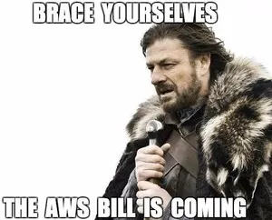
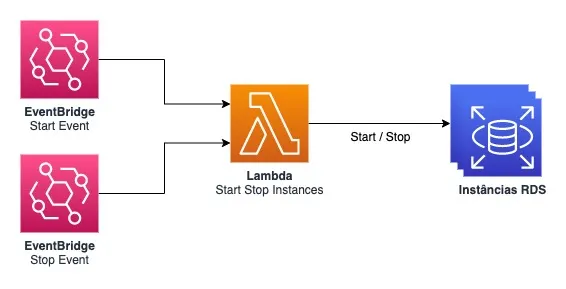
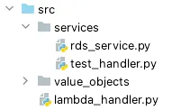
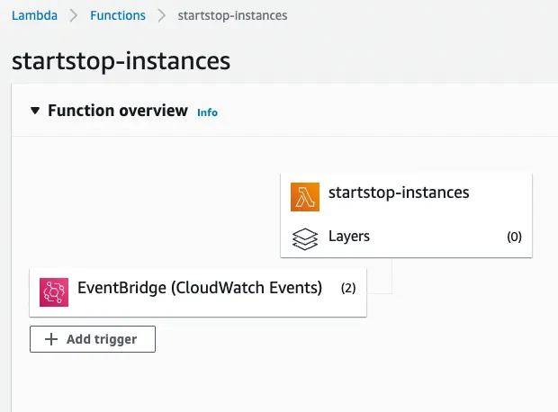
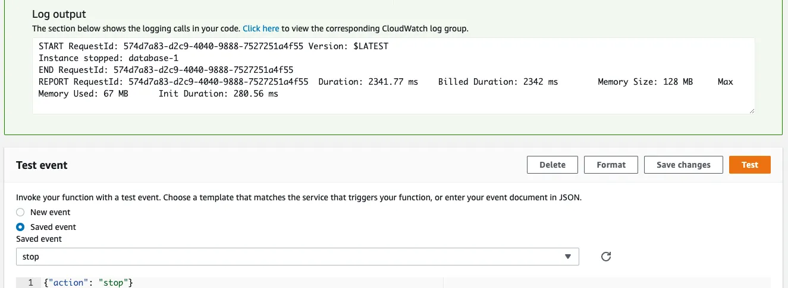

A partir desse artigo, você conseguirá implementar um lambda na AWS para automatizar o desligamento de instâncias em 
horários que não serão utilizadas.

<!-- truncate -->


## Introdução
Utilizar serviços cloud é inevitável nos dias atuais, seja para modernizar aplicações legado ou construir produtos escaláveis de forma rápida. Contudo, é necessário tomar cuidado com algo que muitas pessoas acabam ignorando ao desenvolver e implantar aplicações na nuvem: o custo.

Para não termos surpresas no final do mês ao receber a fatura da AWS, é necessário tomar algumas medidas preventivas. Nesse artigo, abordarei o desligamento de recursos nos ambientes de desenvolvimento em horários que não serão utilizados.

<center>

</center>

Sabe aquelas instâncias RDS ou ECS Tasks nos ambientes de desenvolvimento que ficam paradas aos fins de semana? Ou após o fim do expediente? Vamos criar uma automação para desligá-las fora do horário comercial, assim não precisaremos nos preocupar em desligar manualmente e também conseguiremos economizar bastante.



## Quanto será economizado?
Para os cálculos de economia, utilizaremos a região US East (Ohio) e uma instância RDS MySQL, db.m4.large, Single AZ, 2 vCPU, 8GB RAM, e 30GB SSD como parâmetro.

Se deixarmos a instância ligada 24h por dia, em uma semana teremos utilizado 168h, que resulta em, aproximadamente, $131.

Porém, se deixarmos a instância ligada apenas no horário comercial, ou seja, das 9h as 18h, teremos em uma semana utilizado 45h, que resulta em, aproximadamente, $38. **Uma economia de mais de 70%**: $1116 de economia no ano.

Lembre-se, são **dólares**! Além disso, fizemos nosso cálculo para apenas uma instância. Uma empresa pode possuir centenas ou milhares de instâncias dependendo do porte.

## Construindo a automação
Para a automação, construiremos um lambda em Python, que é estimulado por um agendamento para realizar a ação de ligar ou desligar as instâncias RDS.

Para isso, utilizaremos o [SAM](https://aws.amazon.com/serverless/sam/) para facilitar o provisionamento e iniciar nosso projeto:

`$ sam init`

Com o projeto criado, definiremos a infraestrutura do Lambda utilizando CloudFormation:

```yaml
LambdaFunction:
  Type: AWS::Serverless::Function
  Properties:
    FunctionName: startstop-instances
    MemorySize: 128
    Timeout: 10
    Environment:
      Variables:
        REGIONS: !Ref Regions
    Policies:
      - Statement:
          - Sid: RDSStartStopPolicy
            Effect: Allow
            Action:
              - rds:DescribeDBInstances
              - rds:StartDBInstance
              - rds:StopDBInstance
            Resource: '*'
    CodeUri: src/
    Handler: lambda_handler.lambda_handler
    Runtime: python3.13
    Events:
      Start:
        Type: Schedule
        Properties:
          Schedule: cron(0 12 ? * MON-FRI *)
          Input: '{"action": "start"}'
      Stop:
        Type: Schedule
        Properties:
          Schedule: cron(0 20 ? * MON-FRI *)
          Input: '{"action": "stop"}'
```

Pelas policies, o lambda terá acesso para listar, ligar e desligar as instâncias de toda a conta, em qualquer região.

Também foram definidos os dois eventos que estimularão a aplicação. O start, de segunda a sexta-feira, às 9h (12h UTC) e o stop, de segunda a sexta-feira, às 18h (20h UTC). O formato utilizado para esses parâmetros é no formato cron. Você também pode utilizar algum gerador online para definir uma data ou horário específico diferente do padrão: https://crontab.guru.

Além disso, precisaremos definir o parâmetro Regions que será utilizado pelo lambda para varrer somente as regiões definidas:

```yaml
Parameters:
  Regions:
    Type: String
    Description: Regions which instances are going to be affected
    Default: sa-east-1,us-east-1
```

Agora que a infraestrutura está definida. Iremos ao código Python:



lambda_handler.py é o entrypoint da nossa aplicação, esse arquivo contém a função que será invocada.

```python
def lambda_handler(event, context):
    action = event.get('action', 'undefined')

    if action == 'start':
        for service in services:
            service.start_instances()
    elif action == 'stop':
        for service in services:
            service.stop_instances()
    else:
        print('Unknown action:', action)

    return {
        "statusCode": 200
    }
```

O pacote services possui duas classes: ResourceService e RDSService. A classe ResourceService é uma classe abstrata. A partir dela, implementaremos a lógica de ligar e desligar as instâncias.
```python
class ResourceService:
    def __init__(self, regions: List[str]):
        self.regions = regions
        self.client = None

    def start_instances(self) -> None:
        pass

    def stop_instances(self) -> None:
        pass
```

Nesse artigo, estamos focando apenas no serviço RDS, porém com essa estrutura, poderíamos, por exemplo, implementar para ECS Fargate com facilidade. Logo, implementaremos da seguinte forma:
```python
class RDSService(ResourceService):

    def start_instances(self) -> None:
        self.__for_instances(self.__start)

    def stop_instances(self) -> None:
        self.__for_instances(self.__stop)

    def __for_instances(self, function: Callable):
        for region in self.regions:
            try:
                self.client = boto3.client(RDS.CLIENT_NAME, region_name=region)
            except Exception as e:
                print("Cannot instantiate client in region", region, e)
                continue

            pages = self.client.get_paginator(RDS.DESCRIBE_INSTANCES_COMMAND) \
                        .paginate(PaginationConfig={RDS.PAGE_SIZE: 30})

            for page in pages:
                for instance in page.get(RDS.INSTANCES):
                    identifier = instance.get(RDS.IDENTIFIER)
                    function(
                        status=instance.get(RDS.STATUS),
                        identifier=identifier
                    )

    def __start(self, status: str, identifier: str):
        if status != 'stopped':
            print(f'Instance "{identifier}" cannot be started. Current status: {status}')
            return
        self.client.start_db_instance(DBInstanceIdentifier=identifier)
        print('Instance started:', identifier)

    def __stop(self, status: str, identifier: str):
        if status != 'available':
            print(f'Instance "{identifier}" cannot be stopped. Current status: {status}')
            return
        self.client.stop_db_instance(DBInstanceIdentifier=identifier)
        print('Instance stopped:', identifier)
```

Na ação de start, validamos se a instância está parada, se estiver, ligaremos. Já na ação de stop, a validação é a inversa: se estiver ligada, desligamos.

Com o lambda implementado, podemos realizar o deploy na nossa conta AWS com o comando:

`$ sam deploy --guided`



Podemos testar nossa aplicação na aba Test, com o seguinte payload:

`{"action": "stop"}`



Todo o código mostrado nesse artigo está disponível por completo no [GitHub](https://github.com/margato/lambda-rds-startstop).