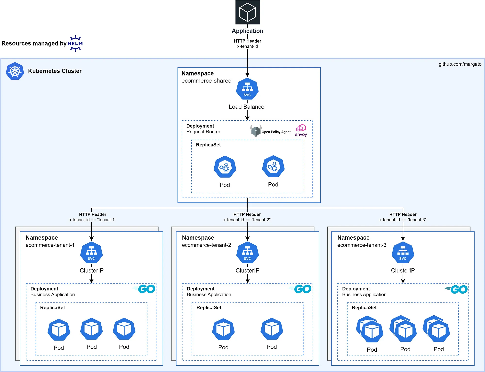

+++
date = '2024-10-09T21:46:26-03:00'
draft = false
title = 'Multi-tenant applications with Kubernetes and Helm'
tags = ['kubernetes', 'helm', 'multi-tenant', 'aws', 'eks']
authors = ['osvaldo']
+++

## Introduction
In a scenario where the same software is offered to different customers (tenants), we need architectural patterns that isolate them to prevent problems such as:

- Data leakage
- Compliance and regulatory issues
- Performance impact on one customer caused by another ([Noisy Neighbors](https://en.wikipedia.org/wiki/Cloud_computing_issues#Performance_interference_and_noisy_neighbors))

In a multi-tenant architecture, depending on business maturity, contractual requirements, and budget, different strategies can be adopted, including:

- **Pool:** Share-Everything — Tenants share resources but are logically isolated, for example, in the database schema.
- **Silo:** Share-Nothing — Each tenant has dedicated resources, providing resource-level isolation and avoiding noisy neighbor issues.
- **Bridge:** Hybrid approach — Uses shared services while critical workloads are isolated in resource-level silos.

In this article, I present a proof of concept of an architecture that follows the **bridge** strategy, with a single entry point where requests are routed to the application plane of each tenant.

The advantage of this solution is that we can share app planes with less critical tenants and isolate more important ones in dedicated silos. For this, applications must be treated as deployable artifacts across different planes without duplicating code or creating tenant-specific affinities.

## Containers
Each tenant has its own namespace, ensuring logical isolation within a single [Kubernetes](https://kubernetes.io/) cluster. In this POC, I do not go into node-level distribution and isolation; however, in production, tenants can be placed on separate node groups in [EKS](https://docs.aws.amazon.com/eks/latest/userguide/what-is-eks.html) based on criticality.

For the application, there is a single source of truth for the [source code](https://github.com/margato/multi-tenant-k8s/tree/main/apps/products-api), managed as an artifact by [Helm](https://github.com/margato/multi-tenant-k8s/tree/main/infra/helm). This allows deploying the app in multiple namespaces while changing only values such as memory/CPU limits and Horizontal Pod Autoscaler configuration.

## Routing and Authorization
The routing layer is supported by [Envoy Proxy](https://www.envoyproxy.io/) as a reverse proxy and [Open Policy Agent (OPA)](https://www.openpolicyagent.org/), providing authorization for the requested application plane. Envoy and OPA communicate over gRPC locally inside the pod, as a sidecar, offering low latency.

Each request is routed based on an HTTP header named `x-tenant-id`. For security, OPA evaluates the provided JWT to verify the header matches the token claims and to confirm tenant existence.

Note that this Rego implementation does not validate JWT signature or expiration, as it is a proof of concept; in production, this validation is essential.

## Run locally
To test on your machine or inspect the POC implementation source code, visit https://github.com/margato/multi-tenant-k8s

## References
- [Re-defining multi-tenancy](https://docs.aws.amazon.com/whitepapers/latest/saas-architecture-fundamentals/re-defining-multi-tenancy.html)
- [Silo, Pool, Bridge Models](https://docs.aws.amazon.com/wellarchitected/latest/saas-lens/silo-pool-and-bridge-models.html)
