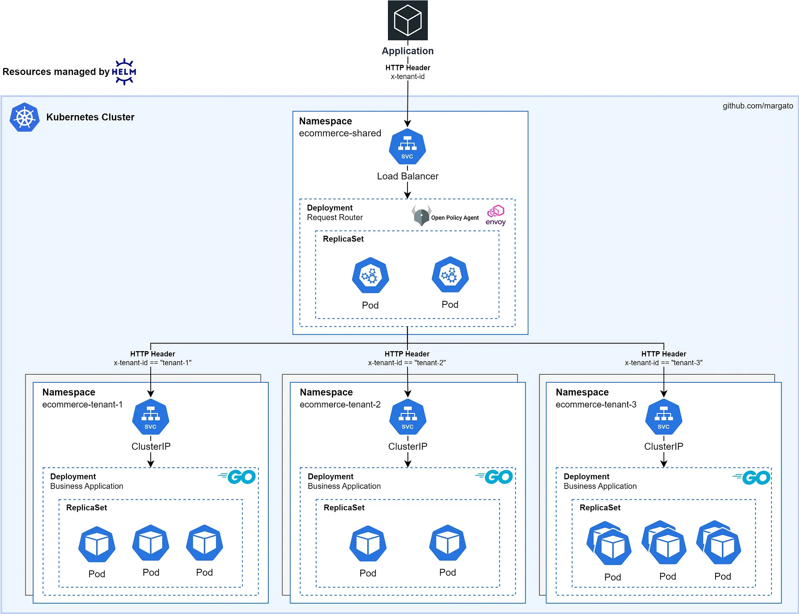

## Introdução
Em um cenário que um mesmo software é comercializado para diferentes clientes (tenants), é necessário aplicar padrões de arquitetura que os isolem para que evitemos problemas como:

- Vazamento de dados
- Compliance e regulatórios
- Impactos de performance em um cliente, causado por outro ([Noisy Neighbors](https://en.wikipedia.org/wiki/Cloud_computing_issues#Performance_interference_and_noisy_neighbors))

Em uma arquitetura multi-tenant, dependendo da maturidade do negócio, necessidades contratuais e de orçamento, diferentes estratégias podem ser adotadas, dentre elas, destaco:

- **Pool:** Share-Everything — Tenants compartilham recursos, mas são isolados logicamente, por exemplo, no nível do schema do banco de dados.
- **Silo:** Share-Nothing — Cada tenant tem recursos dedicados, proporcionando isolamento em nível de recurso, evitando o problema de Vizinhos Barulhentos (Noisy Neighbors).
- **Bridge:** Abordagem híbrida — Usa de serviços compartilhados, enquanto workloads críticos são isolados a nível de recurso.

Neste artigo, apresento uma prova de conceito de uma arquitetura que segue a estratégia **bridge**, com um único ponto de entrada, onde as solicitações são direcionadas para o plano de aplicação correspondente a cada tenant.

A vantagem dessa solução é que podemos compartilhar planos de aplicação com tenants menos críticos, isolando os mais importantes em silos dedicados. Porém, para isso, devemos tratar as aplicações como artefatos que possam ser implantados em diferentes planos, sem necessidade de duplicar código ou criar afinidades específicas com tenants.

## Containers
Cada tenant tem seu próprio namespace, garantindo isolamento lógico dentro de um único cluster [Kubernetes](https://kubernetes.io/). Nesta POC, não aprofundo na distribuição e isolamento a nível de Nodes, no entanto, em um ambiente de produção, os tenants podem ser isolados em diferentes grupos de nós usando node groups do [EKS](https://docs.aws.amazon.com/eks/latest/userguide/what-is-eks.html), por exemplo, com base em sua criticidade.

Para a aplicação, há uma única fonte da verdade para o [código-fonte](https://github.com/margato/multi-tenant-k8s/tree/main/apps/products-api) que é gerenciado como um artefato pelo [Helm](https://github.com/margato/multi-tenant-k8s/tree/main/infra/helm). Isso permite que a aplicação seja implantada em múltiplos namespaces enquanto apenas valores como limites de memória e CPU e configuração do Horizontal Pod Autoscaler (HPA) são alterados.

## Roteamento e autorização
A camada de roteamento é suportada pelo [Envoy Proxy](https://www.envoyproxy.io/) como um reverse proxy, e [Open Policy Agent (OPA)](https://www.openpolicyagent.org/), fornecendo autorização ao plano de aplicação solicitado. A comunicação entre Envoy e OPA é feita por gRPC e localmente dentro do Pod, como um *sidecar*, proporcionando baixa latência.

Cada solicitação é direcionada com base em um HTTP header nomeado como `x-tenant-id`. Para fornecer segurança, o OPA avalia o JWT fornecido para verificar se há match entre o valor do header e os token claims, bem como para validar a existência do tenant.

Observe que essa implementação *Rego* não valida a assinatura do JWT e nem a expiração do token, pois isso é apenas uma prova de conceito; em um ambiente de produção, essa validação é essencial.

## Execute localmente
Para testar em sua máquina ou ver o código fonte da implementação da POC, acesse o repositório original: https://github.com/margato/multi-tenant-k8s

## Referências
- [Re-defining multi-tenancy](https://docs.aws.amazon.com/whitepapers/latest/saas-architecture-fundamentals/re-defining-multi-tenancy.html)
- [Silo, Pool, Bridge Models](https://docs.aws.amazon.com/wellarchitected/latest/saas-lens/silo-pool-and-bridge-models.html)

import GiscusComments from '@site/src/components/GiscusComments'

<GiscusComments /> 